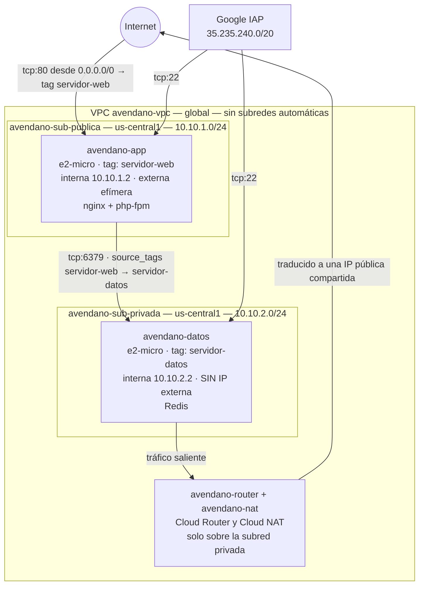

# Práctica 3 — Una red propia, dos máquinas y una aplicación

**Computación en la Nube · Universidad Francisco de Paula Santander**

| | |
|---|---|
| **Equipo** | Carlos Antonio Avendaño — código 1152406 — `carlosantonioav@ufps.edu.co`<br>Juan David Marciales Niebles — código 1152431 — `juandavidmn@ufps.edu.co` |
| **Proyecto de Google Cloud** | `nube-2026-ii` |
| **Prefijo de recursos** | `avendano` |
| **Región / zona** | `us-central1` / `us-central1-a` |
| **Repositorio** | https://github.com/carloxavz/practica-3-red |

---

## 1. Diagrama de la infraestructura



**Cómo se lee:** el tráfico público entra únicamente por el puerto 80 de la máquina de
aplicación. La máquina de datos no tiene dirección pública, así que nadie de fuera puede
iniciar una conexión contra ella: solo sale, a través del Cloud NAT, y solo recibe tráfico
interno desde máquinas con la etiqueta `servidor-web`. La administración de ambas se hace
por el túnel de IAP, nunca con el 22 abierto a internet.

---

## 2. Organización del código

```
practica-3-red/
├── main.tf              # solo terraform {} y provider {}
├── red.tf               # VPC, las dos subredes, Cloud Router y Cloud NAT
├── computo.tf           # las dos instancias
├── firewall.tf          # las tres reglas de entrada
├── variables.tf         # 7 variables
├── outputs.tf           # 6 salidas
├── terraform.tfvars     # valores del proyecto y el prefijo
├── arranque-app.sh      # script de arranque de la aplicación (plantilla)
├── arranque-datos.sh    # script de arranque de la máquina de datos
├── evidencias/          # capturas de las seis evidencias
└── .gitignore           # el estado nunca llega al repositorio
```

---

## 3. Evidencias

### Evidencia 0 — Preparación


```
$ terraform version
Terraform v1.9.5
on linux_amd64
+ provider registry.terraform.io/hashicorp/google v8.2.0

$ gcloud config list
[core]
account = carlosantonioav@ufps.edu.co
project = nube-2026-ii
universe_domain = googleapis.com

$ gcloud services enable compute.googleapis.com
$ gcloud services enable iap.googleapis.com
$ git clone https://github.com/carloxavz/practica-3-red.git
$ cd practica-3-red
```

---

### Evidencia 1 — La red y su subred

**1.1 — El `apply` de la fase 1, con los dos recursos creados**


```
$ terraform init
$ terraform plan
Plan: 2 to add, 0 to change, 0 to destroy.

$ terraform apply
google_compute_network.vpc: Creation complete after 21s
  [id=projects/nube-2026-ii/global/networks/avendano-vpc]
google_compute_subnetwork.publica: Creation complete after 12s
  [id=projects/nube-2026-ii/regions/us-central1/subnetworks/avendano-sub-publica]

Apply complete! Resources: 2 added, 0 changed, 0 destroyed.
```

La VPC se creó con `auto_create_subnetworks = false`, así que nació vacía: sin subredes y
sin una sola regla de cortafuegos. La red `default` del proyecto, en contraste, trae una
subred en cada región del mundo y cuatro reglas que nadie pidió, dos de ellas abriendo los
puertos de administración (22 y 3389) a internet entero y sin etiqueta de destino, de modo
que aplican a cualquier máquina que se cree ahí. Por eso nada de esta práctica vive en
`default`.

**1.2 — La lista de subredes, con nombre, región y rango**


```
$ gcloud compute networks subnets list --filter="network:avendano-vpc" \
    --format="table(name, region, ipCidrRange)"

NAME: avendano-sub-privada
REGION: us-central1
RANGE: 10.10.2.0/24

NAME: avendano-sub-publica
REGION: us-central1
RANGE: 10.10.1.0/24
```

> La fase 1 creó una sola subred, `avendano-sub-publica`. La segunda,
> `avendano-sub-privada`, nace en la fase 6; esta captura es del estado final del
> repositorio, por eso aparecen las dos.

---

### Evidencia 2 — Variables y salidas


```
$ terraform plan
No changes. Your infrastructure matches the configuration.

Terraform has compared your real infrastructure against your configuration
and found no differences, so no changes are needed.

$ terraform output
ip_interna_app   = "10.10.1.2"
ip_interna_datos = "10.10.2.2"
ip_publica_app   = "146.148.109.107"
red              = "avendano-vpc"
subred_privada   = "https://www.googleapis.com/compute/v1/projects/nube-2026-ii/regions/us-central1/subnetworks/avendano-sub-privada"
subred_publica   = "https://www.googleapis.com/compute/v1/projects/nube-2026-ii/regions/us-central1/subnetworks/avendano-sub-publica"
```

El refactor sacó a variables el identificador del proyecto, el prefijo, la región, la zona,
el tipo de máquina y los dos rangos. No se tocó la infraestructura y el plan no propuso
ningún cambio, que es exactamente el resultado esperado de esta fase.

> La fase 2 pedía dos salidas, `red` y `subred_publica`. Las otras cuatro se añadieron en
> las fases 3 y 6, por eso la captura muestra seis.

---

### Evidencia 3 — La aplicación


```
$ gcloud compute instances describe avendano-app --zone us-central1-a \
    --format="yaml(name, zone, machineType, networkInterfaces)"

machineType: .../zones/us-central1-a/machineTypes/e2-micro
name: avendano-app
networkInterfaces:
- accessConfigs:
  - kind: compute#accessConfig
    name: external-nat
    natIP: 146.148.109.107
    networkTier: PREMIUM
    type: ONE_TO_ONE_NAT
  kind: compute#networkInterface
  name: nic0
  network: .../global/networks/avendano-vpc
  networkIP: 10.10.1.2
  stackType: IPV4_ONLY
  subnetwork: .../regions/us-central1/subnetworks/avendano-sub-publica
zone: .../zones/us-central1-a
```

La interfaz pertenece a `avendano-sub-publica` y no a `default`, y la IP interna `10.10.1.2`
cae dentro del rango declarado `10.10.1.0/24`.

---

### Evidencia 4 — Las puertas

**4.1 — La aplicación alcanzable desde fuera, con la IP visible**


**4.2 — Las reglas de cortafuegos, con sus orígenes y etiquetas**


```
$ gcloud compute firewall-rules list --filter="network:avendano-vpc" \
    --format="table(name, allowed[].map().firewall_rule().list(), \
                    sourceRanges.list(), sourceTags.list(), targetTags.list())"

NAME: avendano-permitir-http
ALLOW: tcp:80
SOURCE_RANGES: 0.0.0.0/0
SOURCE_TAGS:
TARGET_TAGS: servidor-web

NAME: avendano-permitir-redis-interno
ALLOW: tcp:6379
SOURCE_RANGES:
SOURCE_TAGS: servidor-web
TARGET_TAGS: servidor-datos

NAME: avendano-permitir-ssh-iap
ALLOW: tcp:22
SOURCE_RANGES: 35.235.240.0/20
SOURCE_TAGS:
TARGET_TAGS: servidor-web,servidor-datos
```

| Regla | Puerto | Origen | Etiqueta de destino |
|---|---|---|---|
| `avendano-permitir-http` | tcp:80 | `0.0.0.0/0` | `servidor-web` |
| `avendano-permitir-ssh-iap` | tcp:22 | `35.235.240.0/20` | `servidor-web`, `servidor-datos` |
| `avendano-permitir-redis-interno` | tcp:6379 | etiqueta `servidor-web` | `servidor-datos` |

El 22 nunca se abre a internet: solo al rango desde el que Google reenvía las conexiones ya
autorizadas por IAP. Y las tres reglas apuntan a etiquetas, no a la red entera, así que una
máquina futura no queda expuesta sin que alguien lo decida explícitamente.

> La fase 4 pedía dos reglas. La tercera, `avendano-permitir-redis-interno`, nace en la
> fase 6.

**4.3 — Sesión SSH establecida por IAP**


```
$ gcloud compute ssh avendano-app --zone us-central1-a --tunnel-through-iap

carlosantonioav@avendano-app:~$ hostname -I
10.10.1.2

carlosantonioav@avendano-app:~$ systemctl status nginx --no-pager
● nginx.service - A high performance web server and a reverse proxy server
     Loaded: loaded (/lib/systemd/system/nginx.service; enabled; preset: enabled)
     Active: active (running) since Sun 2026-09-20 21:04:13 UTC
```

---

### Evidencia 5 — Reproducir desde cero

**5.1 — El `destroy` y los listados vacíos**


```
$ terraform destroy
google_compute_firewall.ssh_iap: Destruction complete after 11s
google_compute_firewall.app_http: Destruction complete after 11s
google_compute_firewall.app_a_datos: Destruction complete
google_compute_instance.app: Destruction complete after 21s
google_compute_instance.datos: Destruction complete
google_compute_router_nat.nat: Destruction complete
google_compute_router.router: Destruction complete
google_compute_subnetwork.publica: Destruction complete after 11s
google_compute_subnetwork.privada: Destruction complete
google_compute_network.vpc: Destruction complete after 21s

Destroy complete! Resources: 10 destroyed.

$ gcloud compute instances list
Listed 0 items.

$ gcloud compute networks list
NAME: default
SUBNET_MODE: AUTO

$ gcloud compute routers list
Listed 0 items.
```

El orden de destrucción no lo escribimos nosotros: sale del grafo de dependencias recorrido
al revés. Primero las máquinas y las reglas, después el NAT y el router, luego las subredes,
y de último la red. El listado de routers no lo pide la guía, pero es el recurso que factura
por existir: conviene dejar probado que se fue.

**5.2 — La reconstrucción, con la aplicación respondiendo en la IP nueva**


```
$ terraform apply
Apply complete! Resources: 10 added, 0 changed, 0 destroyed.

$ curl -s http://$(terraform output -raw ip_publica_app) | head -20
```

La IP pública es distinta a la de antes del `destroy`, porque es efímera. Que el dato cambie
y la infraestructura sea la misma es justamente la idea: lo que se declara es la forma, no
los valores que asigna el proveedor. Una infraestructura que no se puede reconstruir desde
cero no es infraestructura como código.

---

### Evidencia 6 — La máquina que nadie puede alcanzar

El diagrama de la red final está en la sección 1 de este documento.

**6.1 — Aislamiento desde fuera: la máquina de datos no tiene dirección pública**


```
$ gcloud compute instances list
NAME: avendano-app
ZONE: us-central1-a
MACHINE_TYPE: e2-micro
INTERNAL_IP: 10.10.1.2
EXTERNAL_IP: 146.148.109.107
STATUS: RUNNING

NAME: avendano-datos
ZONE: us-central1-a
MACHINE_TYPE: e2-micro
INTERNAL_IP: 10.10.2.2
EXTERNAL_IP:
STATUS: RUNNING

$ curl -m 8 http://10.10.2.2
curl: (28) Connection timed out after 8002 milliseconds
```

`avendano-datos` tiene la columna `EXTERNAL_IP` vacía: no es que esté filtrada, es que no
existe. Y `10.10.2.2` no se enruta fuera de la VPC, por eso la petición se agota sin
respuesta. La petición que se queda esperando hasta agotar el tiempo es la firma de un
paquete descartado; un servidor apagado habría contestado «conexión rechazada» de inmediato.

**6.2 — La aplicación sirviendo el dato que vino de la máquina privada**


```
$ curl -s http://146.148.109.107

<h1>CARLOS AVENDANO</h1>
<p>Servidor de aplicacion. IP interna: <b>10.10.1.2</b></p>

<h2>Dato traido de la maquina privada</h2>
<ul>
  <li>Articulos en inventario: <b>1482</b></li>
  <li>Bodega: <b>Cucuta - Norte de Santander</b></li>
</ul>
<p>Origen del dato: maquina de datos privada 10.10.2.2</p>
<p>Consultado por Redis en 10.10.2.2:6379,
   por la red interna de la VPC. Esa maquina no tiene IP publica.</p>

$ terraform output ip_interna_datos
"10.10.2.2"
```

Esta es la otra mitad de la prueba de aislamiento: la misma dirección `10.10.2.2` que desde
fuera se agota sin respuesta, desde la máquina de aplicación contesta y entrega el dato. Lo
que cambia no es la red, es la etiqueta `servidor-web` que lleva el origen, que es lo único
que acepta `avendano-permitir-redis-interno`.

**6.3 — La dependencia es real: sin la máquina de datos, la página no se sirve**


```
$ IP=$(terraform output -raw ip_publica_app)
$ gcloud compute instances stop avendano-datos --zone us-central1-a
Stopping instance(s) avendano-datos...done.

$ curl -i -m 10 http://$IP
HTTP/1.1 503 Service Unavailable
Server: nginx/1.22.1
Content-Type: text/plain; charset=utf-8

503 Service Unavailable

La maquina de datos (10.10.2.2:6379) no responde.
Esta pagina no se puede servir sin ella.

Detalle: Connection timed out

$ gcloud compute instances start avendano-datos --zone us-central1-a
Starting instance(s) avendano-datos...done.
Instance internal IP is 10.10.2.2

$ sleep 60 && curl -s http://$IP | head -20
<h1>CARLOS AVENDANO</h1>
<p>Servidor de aplicacion. IP interna: <b>10.10.1.2</b></p>
<h2>Dato traido de la maquina privada</h2>
  <li>Articulos en inventario: <b>1482</b></li>
  <li>Bodega: <b>Cucuta - Norte de Santander</b></li>
```

Con la máquina de datos apagada la aplicación devuelve 503 y no sirve la página; al
encenderla, vuelve sola. La dependencia no es decorativa: la página se construye en cada
petición consultando a la otra máquina, y si esa consulta falla no hay página que entregar.

**6.4 — Administración de la máquina sin IP pública, y su salida por el NAT**


```
$ gcloud compute ssh avendano-datos --zone us-central1-a --tunnel-through-iap
Linux avendano-datos 6.1.0-53-cloud-amd64 #1 SMP PREEMPT_DYNAMIC Debian 6.1.187-1 x86_64

carlosantonioav@avendano-datos:~$ curl -s ifconfig.me ; echo
35.193.223.250

carlosantonioav@avendano-datos:~$ exit
logout
Connection to compute.5589202315817878709 closed.
```

Dos cosas en una sola sesión. Primero, que se puede administrar una máquina que no tiene
dirección pública: se entra por el túnel de IAP, que es el único origen autorizado para el
22. Y segundo, que esa máquina sí tiene salida a internet: la `35.193.223.250` que reporta
`ifconfig.me` es la dirección que le presta el Cloud NAT, no suya. Sale, pero nadie puede
entrar, porque no hay dirección a la que dirigirse. Es la misma salida por la que el script
de arranque instaló Redis.

---

## 4. Comandos ejecutados

```bash
# Preparación
TFVER="1.9.5"
mkdir -p ~/bin && cd ~
curl -sLO https://releases.hashicorp.com/terraform/${TFVER}/terraform_${TFVER}_linux_amd64.zip
unzip -o terraform_${TFVER}_linux_amd64.zip -d ~/bin
rm terraform_${TFVER}_linux_amd64.zip
echo 'export PATH=$HOME/bin:$PATH' >> ~/.bashrc && source ~/.bashrc
terraform version

gcloud config list
gcloud services enable compute.googleapis.com
gcloud services enable iap.googleapis.com
cd ~ && git clone https://github.com/carloxavz/practica-3-red.git
cd practica-3-red

# Ciclo de trabajo, en cada fase
git pull
terraform init
terraform plan
terraform apply
terraform output

# Comprobaciones
curl -m 8 http://$(terraform output -raw ip_publica_app)
gcloud compute instances list
gcloud compute networks list
gcloud compute routers list
gcloud compute networks subnets list --filter="network:avendano-vpc" \
  --format="table(name, region, ipCidrRange)"
gcloud compute instances describe avendano-app --zone us-central1-a \
  --format="yaml(name, zone, machineType, networkInterfaces)"
gcloud compute firewall-rules list --filter="network:avendano-vpc" \
  --format="table(name, allowed[].map().firewall_rule().list(), sourceRanges.list(), sourceTags.list(), targetTags.list())"

# Acceso por IAP a las dos máquinas
gcloud compute ssh avendano-app   --zone us-central1-a --tunnel-through-iap
gcloud compute ssh avendano-datos --zone us-central1-a --tunnel-through-iap

# Prueba de la dependencia real
gcloud compute instances stop  avendano-datos --zone us-central1-a
curl -i -m 10 http://$(terraform output -raw ip_publica_app)
gcloud compute instances start avendano-datos --zone us-central1-a

# Reproducibilidad
terraform destroy
terraform apply
```

---

## 5. Las cuatro decisiones libres

**Qué se desplegó en la máquina de datos: Redis en el 6379.**
Se eligió un servicio de datos real en vez de otro servidor web, para que la máquina privada
tenga un papel distinto al de la pública y no sea una copia de ella. El 6379 es el puerto
estándar de Redis, no un número arbitrario, lo que hace que la regla de cortafuegos se
explique sola. Con PostgreSQL en el 5432 el resultado de red habría sido idéntico —cambia
el paquete, el script de arranque y la librería del cliente, no la topología—; con otro
nginx en el 8080 la máquina de datos habría dejado de justificar su nombre.

**Organización de los archivos `.tf`: separados por función.**
`red.tf` para el direccionamiento y la salida a internet, `computo.tf` para las máquinas y
`firewall.tf` para las reglas. El criterio es el ritmo al que cambia cada cosa: el
direccionamiento casi nunca se toca, las reglas cambian cada vez que aparece un servicio y
las máquinas cambian más a menudo todavía. Terraform lee todos los `.tf` del directorio
como si fueran uno solo, así que la separación no altera el resultado: es para poder abrir
el archivo correcto sin buscar.

**Administración de la máquina sin IP pública: túnel SSH por IAP.**
Google reenvía la conexión desde el rango `35.235.240.0/20`, que es el único origen
autorizado para el 22 en ambas máquinas. Eso permite una sesión interactiva completa sin
que exista una sola dirección pública que atacar, y deja registro de quién entró en los
logs de IAP. Lo que no permite es alcanzar otros puertos de la máquina sin abrirlos
explícitamente, ni entrar si se cae el control de acceso de Google. Las alternativas
—un bastión con IP pública, o un cliente VPN— habrían añadido una máquina más que mantener
y una superficie expuesta que aquí no existe.

**Direccionamiento de las dos subredes: `10.10.1.0/24` y `10.10.2.0/24`.**
Rangos contiguos dentro del mismo bloque `10.10.0.0/16`, lo que permite resumir toda la red
en una sola ruta si mañana hay que conectarla con otra, y deja `10.10.3.0/24` en adelante
libre para crecer sin volver a pensar el direccionamiento. Cada `/24` da unas 250 máquinas
utilizables, muy por encima de lo que necesita esta práctica; el tamaño no era el problema.
El riesgo real al conectar esta red con otra es el solape: si la red destino usara también
`10.10.x.x`, las dos redes no se podrían emparejar y la deuda se pagaría migrando el
direccionamiento, no ajustándolo.

---

## 6. Las tres preguntas

### 6.1. Si le quitas la etiqueta de red a la máquina de aplicación y aplicas, ¿qué deja de funcionar exactamente, y por qué la regla de cortafuegos sigue existiendo?

La máquina no se entera de nada: `tags` es un atributo modificable en caliente, así que el
plan diría `1 to change` y no `1 to destroy`, la instancia seguiría encendida, nginx seguiría
escuchando en el 80 y las dos IP seguirían siendo las mismas. Lo que se rompe es la
correspondencia con las reglas. `avendano-permitir-http` apunta a `target_tags =
["servidor-web"]`; sin esa etiqueta la máquina deja de estar en el conjunto al que la regla
aplica, ninguna otra regla permite el 80, y como en una VPC la entrada se deniega por
defecto, las peticiones se descartan en silencio: el navegador se queda esperando hasta
agotar el tiempo, no recibe «conexión rechazada». Esa distinción importa, porque el timeout
es la firma de un paquete descartado por un cortafuegos y el rechazo inmediato sería la de
un servidor apagado. Se pierden además otras dos cosas: el SSH por IAP, porque
`avendano-permitir-ssh-iap` también apunta a `servidor-web`; y el acceso a Redis, porque
`avendano-permitir-redis-interno` usa `source_tags = ["servidor-web"]` para decidir quién
puede originar ese tráfico, de modo que la aplicación dejaría de poder consultar la máquina
de datos aunque siguieran vecinas en la misma VPC. La regla sigue existiendo porque es un
recurso de la red, no de la instancia: `google_compute_firewall` y `google_compute_instance`
son dos recursos independientes en el estado de Terraform, y lo único que los une es que una
cadena de `target_tags` coincida con una de `tags`. Al quitar la etiqueta se rompe la
coincidencia, no la regla. La regla sigue declarada, sigue apareciendo en la consola y
volvería a aplicarse sola en cuanto cualquier máquina —esta u otra futura— vuelva a llevar
esa etiqueta. Ese desacople es justamente lo que se busca: la regla describe el permiso que
le corresponde a un papel, y cada instancia declara qué papel cumple.

### 6.2. ¿Por qué el plan de la fase 2 no propuso ningún cambio, si el código era distinto? ¿Qué habrías tenido que cambiar para que sí propusiera recrear un recurso?

Porque Terraform no compara código contra código: compara el resultado de evaluar la
configuración contra los valores que tiene guardados en el estado, que son los de la
infraestructura real. Sustituir el literal `"us-central1"` por `var.region`, cuya
`default` es `"us-central1"`, produce exactamente la misma cadena después de evaluarse; para
el proveedor el recurso pide lo mismo que ya tiene y no hay nada que reportar. Con los
outputs pasa algo parecido pero más fuerte: un `output` ni siquiera llega al proveedor, es un
dato que Terraform calcula y muestra al terminar, así que crear `outputs.tf` no puede
producir jamás un cambio en la infraestructura. Para que el plan hubiera propuesto **recrear**
un recurso —y no solo actualizarlo— habría que tocar un atributo que el proveedor no puede
modificar en caliente. El caso más claro aquí es `ip_cidr_range` de la subred: el rango de
una subred no se edita, así que cambiar `10.10.1.0/24` por otro rango obliga a destruirla y
volverla a crear, arrastrando a todo lo que dependa de ella. Lo mismo pasaría con la `zone` o
el `name` de una instancia. En cambio `tags` o `machine_type` sí se actualizan sin recrear:
el plan diría `1 to change`. La diferencia no hay que adivinarla, el plan la marca
explícitamente con `# forces replacement` en el atributo culpable.

### 6.3. Con la red completa encendida, ¿cuánto costaría un mes? Desglosa por recurso y señala cuál es el que más sorprende.

Precios de lista bajo demanda en `us-central1`, sobre 730 horas de mes:

| Recurso | Cantidad | Precio unitario | Al mes |
|---|---|---|---|
| Instancias `e2-micro` (`app` y `datos`) | 2 | $0.008376 / hora | **$12.22** |
| Discos de arranque, 10 GiB `pd-balanced` | 2 | $0.10 / GiB-mes | **$2.00** |
| IP externa efímera de la aplicación, en uso | 1 | $0.005 / hora | **$3.65** |
| Cloud NAT — tarifa de puerta de enlace | 1 VM asignada | $0.0014 / hora por VM | **$1.02** |
| Cloud NAT — IP externa | 1 | $0.005 / hora | **$3.65** |
| Cloud NAT — datos procesados | según uso | $0.045 / GiB | variable |
| Salida a internet, nivel premium a Norteamérica | según uso | $0.12 / GiB tras el primer GiB | variable |
| | | **Fijo mensual** | **≈ $22.54** |

Es decir, unos 22 dólares al mes aunque nadie visite la página ni una sola vez, más el
tráfico. El nivel gratuito de Google Cloud cubre una `e2-micro` al mes en `us-central1` y los
primeros 30 GiB de disco estándar, así que en la práctica la factura real sería menor; la
calculadora oficial es la referencia para el número exacto.

Lo que sorprende no es el cómputo, es la red. Las dos direcciones IPv4 externas y el Cloud
NAT suman **$8.32 al mes**, más que una máquina virtual entera —que cuesta $6.11—, y son la
parte del diseño que uno no piensa como «un recurso». Dentro de eso, el caso llamativo es el
NAT: es el primer recurso del curso que factura por existir y no por trabajar. Apagar las dos
máquinas detiene el cobro del cómputo, pero la IP externa del NAT se sigue pagando hora tras
hora mientras la puerta de enlace exista, y encima cobra $0.045 por GiB procesado, que se
suma al $0.12 por GiB de salida a internet: el mismo byte se paga dos veces. Por eso el
`terraform destroy` al terminar cada sesión de trabajo no es un consejo de limpieza sino
parte del procedimiento.

**Fuentes de los precios:** [Cloud NAT pricing](https://cloud.google.com/nat/pricing) ·
[VPC network pricing](https://cloud.google.com/vpc/network-pricing) ·
[Disks and images pricing](https://cloud.google.com/compute/disks-image-pricing) ·
[Compute Engine pricing](https://cloud.google.com/compute/all-pricing)

---

## 7. El estado no está en el repositorio

```
$ git ls-files
.gitignore
.terraform.lock.hcl
README.md
arranque-app.sh
arranque-datos.sh
computo.tf
evidencias/...
firewall.tf
main.tf
outputs.tf
red.tf
terraform.tfvars
variables.tf
```

Ningún `.tfstate` ni el directorio `.terraform/` llegaron al repositorio, en ningún commit.
El `.gitignore` se creó antes del primer `apply`, no después. Importa porque el estado
describe la infraestructura real y puede contener valores que no deberían ser públicos.
